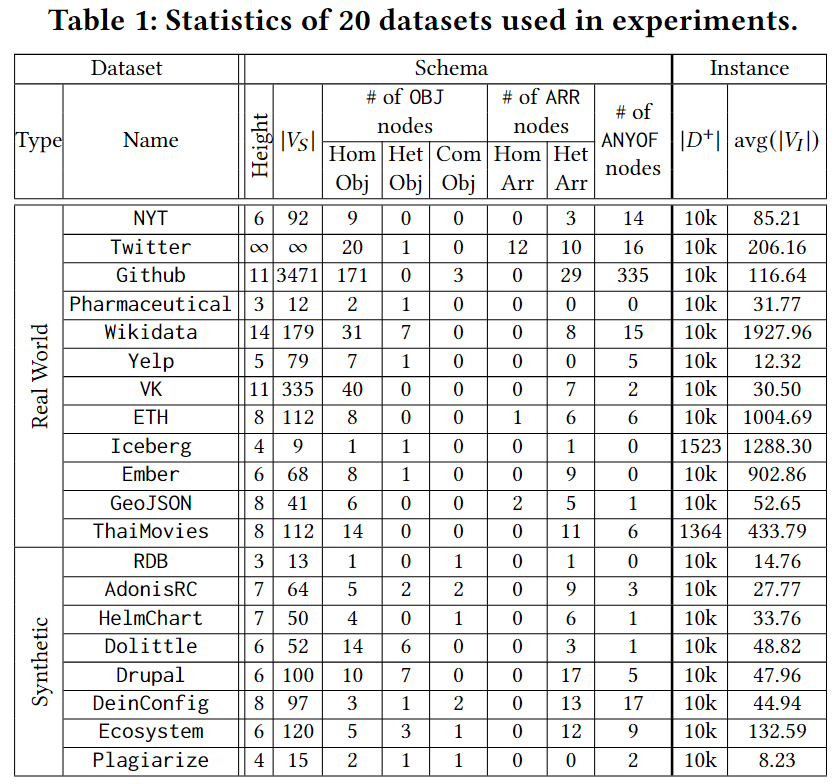

# Dataset and Generation

`Dataset` is a directory saving 12 real-life and 8 synthetic datasets used in the experiments. 

The following is the table explaining the details about the 20 datasets.
<p align = "center">

</p>


## Prerequisites

1. Download of the latest docker container and initiation.


## Explanation About Datasets

Each dataset is comprised of three files

- schema (.json)
- positive instances (.jsonl)
- negative instances (.jsonl)

The positive instances are
- retrieved from public websites or APIs (for real-life datasets)
- generated using the ground truth schemas (for synthetic datasets)

The schemas are
- retrieved from public websites or manually translated into `.json` formats using the official documentations (for real-life datasets)
- retrieved from the [JSON Schema Store](https://www.schemastore.org/json/) (syntehtic datasets)

The negative instances are
- generated using the ground truth schemas

## Negative Instances Generation

You can simply generate negative instances using the following codes.

This may take a few hours, so we recommend you to run this process with `tmux`.
```bash
cd SyntheticDatasetGen
./generateAllNegativeSamples.sh
```

