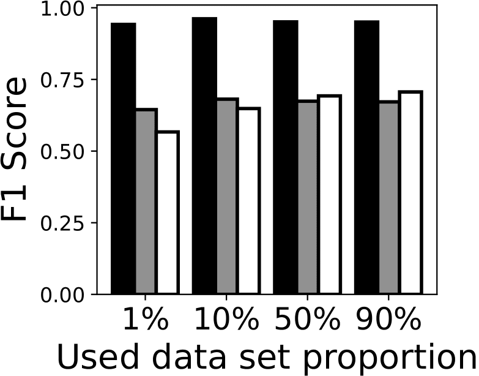
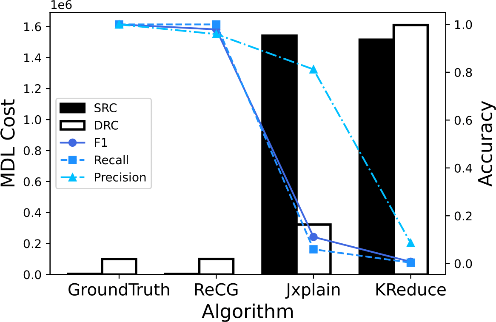
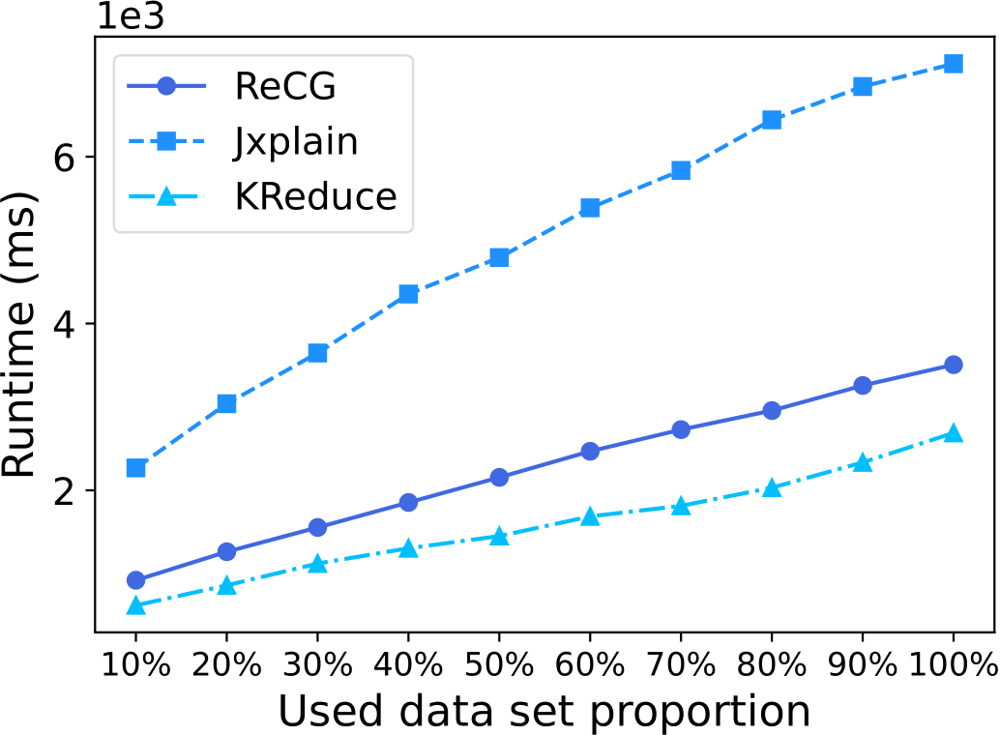

# Experiment Visualization

`ExperimentVisualization` is a directory saving the `Python` implementations that visualize (either as printing in consoles or as drawing plots) experiments conducted in "ReCG: Bottom-Up JSON Schema Discovery Using a Repetitive Cluster-and-Generalize Framework".

## Prerequisites

1. The `Datasets` directory has to exist, with all 20 datasets conforming to their designated names.
It would not be a problem as long as you have not modified any directory structures or files after you created the docker container.

2. It is necessary for the user to build all implementations of `ReCG`, `Jxplain` and `KReduce` (refer to `build` files in the upper directory) before running the experiments.

3. It is necessary for the user to run all the experiments listed below.
    - Accuracy experiment
    - MDL experiment
    - Performance experiment

## Quick Usage

```bash
runAllExperimentVisualizations.sh
```

## Description of Each Visualization

### (A) Visualizing Accuracy Experiment (Section 5.2)


```bash
python3 1.1_AccExperimentVis.py
```
Visualize the accuracy experiment as a plot.
Aggregate (average) the F1 score, recall and precision of each algorithm's schemas for all 20 datasets, when run with a percent of train dataset.
Your results are saved at the `Accuracy` directory.
Here is an example of your result:

<p align = "center">

</p>

```bash
python3 1.2_AccExperimentAgg.py
```
This code aggregates the accuracy measures of `ReCG`, `Jxplain` and `KReduce`.
It shows on console the relationship of F1 score, recall and precision for the three algorithms.

```bash
python3 1.3_AccExperimentTab.py
```
This code generates the latex code for Table 2 of the paper "ReCG: Bottom-Up JSON Schema Discovery Using a Repetitive Cluster-and-Generalize Framework".

### (B) Visualizing MDL Experiment (Section 5.3)

```bash
python3 2.1_MdlExperimentVis.py
```

This code 
- Shows the MDL cost (SRC, DRC) of the schemas found by `ReCG`, `Jxplain` and `KReduce`.
It also shows the accuracies alongside, enabling one to recognize the negative relationship between MDL cost and accuracy.  
- Aggregates the MDL cost and accuracies for all datasets, and show their relationship.

Here is an example of the output: 

<p align = "center">

</p>

```bash
python3 2.2_MdlExperimentAgg.py
```

This code shows the followings on the console:
- The relationship between the MDL costs of schemas found by `ReCG`, `Jxplain`, `KReduce` and the `ground truth schema`s.
- The correlation between `MDL`, `SRC`, `DRC` and `F1 score`, `recall`, `precision`.

### (C) Visualizing Performance Experiment (Section 5.4)

```bash
python3 3.1_PerformanceExperimentVis.py
```

This code shows the runtime of each algorithm for each dataset, when the proportion of the used dataset is increased by `10%`.

Here is an example of the output: 

<p align = "center">

</p>


```bash
python3 3.2_PerformanceExperimentAgg.py
```

This code generates the latex code for Table 4 of the paper "ReCG: Bottom-Up JSON Schema Discovery Using a Repetitive Cluster-and-Generalize Framework".