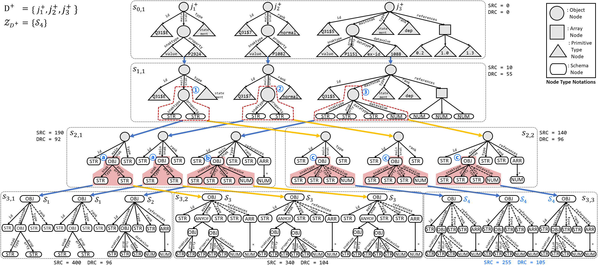

<!-- Improved compatibility of back to top link: See: https://github.com/othneildrew/Best-README-Template/pull/73 -->
<a name="readme-top"></a>
<!--
*** Thanks for checking out the Best-README-Template. If you have a suggestion
*** that would make this better, please fork the repo and create a pull request
*** or simply open an issue with the tag "enhancement".
*** Don't forget to give the project a star!
*** Thanks again! Now go create something AMAZING! :D


<!-- PROJECT SHIELDS -->
<!--
*** I'm using markdown "reference style" links for readability.
*** Reference links are enclosed in brackets [ ] instead of parentheses ( ).
*** See the bottom of this document for the declaration of the reference variables
*** for contributors-url, forks-url, etc. This is an optional, concise syntax you may use.
*** https://www.markdownguide.org/basic-syntax/#reference-style-links
-->
<!-- [![Contributors][contributors-shield]][contributors-url] -->
<!-- [![Forks][forks-shield]][forks-url] -->
<!-- [![Stargazers][stars-shield]][stars-url] -->
<!-- [![Issues][issues-shield]][issues-url] -->
<!-- [![MIT License][license-shield]][license-url] -->
<!-- [![LinkedIn][linkedin-shield]][linkedin-url] -->


<!-- PROJECT LOGO -->
<br />
<div align="center">
  <!-- <a href="https://github.com/github_username/repo_name">
    
  </a> -->

<h3 align = "center">ReCG: Bottom-Up JSON Schema Discovery Using a Repetitive Cluster-and-Generalize Framework</h3>

  <p align = "center">
    ReCG is the first bottom-up JSON schema discovery algorithm.
    <!-- <br />
    <a href="https://github.com/github_username/repo_name"><strong>Explore the docs »</strong></a>
    <br />
    <br />
    <a href="https://github.com/github_username/repo_name">View Demo</a>
    ·
    <a href="https://github.com/github_username/repo_name/issues">Report Bug</a>
    ·
    <a href="https://github.com/github_username/repo_name/issues">Request Feature</a> -->
  </p>
</div>


<!-- TABLE OF CONTENTS -->
<details>
  <summary>Table of Contents</summary>
  <ol>
    <li>
      <a href="#about-recg">About ReCG</a>
    </li>
    <li>
      <a href="#getting-started">Getting Started</a>
      <ul>
        <li><a href="#prerequisites">Prerequisites</a></li>
        <li><a href="#download-docker-image">Download Docker Image</a></li>
        <li><a href="#create-docker-container">Create Docker Container</a></li>
      </ul>
    </li>
    <li><a href="#single-command-reproduction">Single-Command Reproduction</a></li>
    <li><a href="#explanation-about-directories">Explanation About Directories</a></li>
    <li>
      <a href="#quick-overview">Quick Overview</a>
      <ul>
        <li><a href="#1-build-or-compile-algorithms">1. Build or Compile Algorithms</a></li>
        <li><a href="#2-run-experiments">2. Run Experiments</a></li>
        <li><a href="#3-visualize-experiment-results">3. Visualize Experiment Results</a></li>
        <li><a href="#a-run-recg">(A) Run ReCG </a></li>
      </ul>
    </li>

  </ol>
</details>


<!-- ABOUT THE PROJECT -->
## About ReCG

We introduce ReCG, our novel algorithm for JSON schema discovery. ReCG is designed to address the limitations of traditional top-down methods by operating in a bottom-up manner. Here are the key features of ReCG:

- Utilizing a bottom-up approach for JSON schema discovery, which builds tree-structured JSON schemas from leaf elements upwards, ensuring more informed decisions about what type of schema node to derive
- Implementing a repetitive cluster-and-generalize framework that systematically explores candidate schema sets
- Applying the Minimum Description Length (MDL) principle to select the most concise and precise schemas, balancing generality and specificity


<p align = "center">

</p>

Evaluations show ReCG improves recall and precision by up to 47%, resulting in a 46% better F1 score and over twice the speed compared to state-of-the-art techniques.


`ReCG` is implemented with .

<p align="right">(<a href="#readme-top">back to top</a>)</p>


<!-- 
### Built With

* [![Next][Next.js]][Next-url]
* [![React][React.js]][React-url]
* [![Vue][Vue.js]][Vue-url]
* [![Angular][Angular.io]][Angular-url]
* [![Svelte][Svelte.dev]][Svelte-url]
* [![Laravel][Laravel.com]][Laravel-url]
* [![Bootstrap][Bootstrap.com]][Bootstrap-url]
* [![JQuery][JQuery.com]][JQuery-url]

<p align="right">(<a href="#readme-top">back to top</a>)</p> -->

<!-- GETTING STARTED -->

## Getting Started

This page guides you to reproduce the results written in the paper "ReCG: Bottom-Up JSON Schema Discovery Using a Repetitive Cluster-and-Generalize Framework".

Please refer to the instructions below.


### Prerequisites


You must be able to download our docker image from the docker cloud.
Please refer to [Docker Docs](https://docs.docker.com) to download docker.

### Download Docker Image

We made a docker image of our environment.
Please download from docker cloud.

1. Download our image from docker cloud
    ```bash
    docker pull joohyungyun/vldb2024-recg:1.0
    ```

### Create Docker Container

Create a docker container using the downloaded image.

1. Docker run
    ```bash
    docker run -itd --name vldb2024-recg joohyungyun/vldb2024-recg:1.0 /bin/bash
    ```
2. Docker start
    ```bash
    docker start vldb2024-recg
    ```
3. Docker init
    ```bash
    docker init vldb2024-recg
    ```

<p align="right">(<a href="#readme-top">back to top</a>)</p>


## Single-Command Reproduction

The whole reproduction process can be easily done by typing a single line

```bash
./runAll.sh
```

The anticipated runtime of the whole process is over 4 full days, so we recomment you to run the process using `tmux`!

For detailed explanation or for a more fine-grained run, jump to <a href="#quick-overview">Quick Overview</a>


## Explanation about Directories

- ReCG

This directory contains the `C++` implementation of `ReCG`.

Refer to [README](ReCG/README.md) of this directory for more information.

- Dataset

This directory contains all 20 datasets used in the paper "ReCG: Bottom-Up JSON Schema Discovery Using a Repetitive Cluster-and-Generalize Framework".
Due to their file sizes, the datasets are not uploaded on the github repository, but are within our docker image.
Thus, the reproduction will not be successful if one just cloned our github repository.

Refer to [README](Dataset/README.md) of this directory for more information.

- Experiment

This directory contains the `Python` implementations for the four experiments conducted in "ReCG: Bottom-Up JSON Schema Discovery Using a Repetitive Cluster-and-Generalize Framework".

Refer to [README](Experiment/README.md) of this directory for more information.

- ExperimentVisualization

This directory contains the `Python` implementations that visualize (either printing in consoles or drawing plots) experiments conducted in "ReCG: Bottom-Up JSON Schema Discovery Using a Repetitive Cluster-and-Generalize Framework".

Refer to [README](ExperimentVisualization/README.md) of this directory for more information.

<p align="right">(<a href="#readme-top">back to top</a>)</p>


## Quick Overview

We explain our code in a fine-grained manner.
`./runAll.sh` file is comprised in three steps.

### 1. Build or Compile Algorithms

(a) Build C++ Implementations
```bash
cd ReCG
./compile.sh
cd ..
cd ReCG_TopDown
./compile.sh
cd ..
cd Frozza
./compile.sh
cd ..
cd Klettke
./compile.sh
cd ..
```

(b) Build Jxplain

```bash
./buildJxplain.sh
```

(c) Build KReduce
```bash
./buildKReduce.sh
```

### 2. Run Experiments

Run all experiments and return to this directory.
```bash
cd Experiment
./runAllExperiments.sh
cd ..
```

For detailed explanation of each experiments, refer `README.md` of `Experiements` directory.

### 3. Visualize Experiment Results

Run all experiments visualizations and return to this directory.
```bash
cd ExperimentVisualization
./runAllExperimentVisualizations.sh
cd ..
```

For detailed explanation of each experiments, refer `README.md` of `ExperiementVisualizations` directory.


### (A) Run ReCG

If you only want to run `ReCG`, please follow refer below.

You can run `ReCG` in release mode with the following command:
```bash
~/VLDB2024_ReCG/ReCG/build/ReCG
    --in_path [pathToInputFile (.jsonl)]
    --out_path [pathToOutputSchema (.json)]
    --search_alg kbeam
    --beam_width [int]
    --epsilon [float | 0 < x && x <= 1]
    --min_pts_perc [int | 0 < x && x <= 100]
    --sample_size [int | x > 0]
    --src_weight [float | 0 <= src_weight && src_weight <= 1.0 && src_weight + drc_weight == 1]
    --drc_weight [float | 0 <= drc_weight && src_weight <= 1.0 && src_weight + drc_weight == 1]
    --cost_model [{mdl, kse}]
```

You may also run it in the debugging mode with the following command:
```bash
~/VLDB2024_ReCG/ReCG/build-debug/ReCG
    --in_path [pathToInputFile (.jsonl)]
    --out_path [pathToOutputSchema (.json)]
    --search_alg kbeam
    --beam_width [int]
    --epsilon [float | 0 < x && x <= 1]
    --min_pts_perc [int | 0 < x && x <= 100]
    --sample_size [int | x > 0]
    --src_weight [float | 0 <= src_weight && src_weight <= 1.0 && src_weight + drc_weight == 1]
    --drc_weight [float | 0 <= drc_weight && src_weight <= 1.0 && src_weight + drc_weight == 1]
    --cost_model [{mdl, kse}]
```

Example code: try out this one!

```bash
~/VLDB2024_ReCG/ReCG/build/ReCG
    --in_path ~/VLDB2024_ReCG/ReCG/test_data/ckg_node_Amino_acid_sequence.jsonl \
    --out_path something.json \
    --search_alg kbeam \
    --beam_width 3 \
    --sample_size 1000 \
    --epsilon 0.5 \
    --src_weight 0.5 \
    --drc_weight 0.5
```

<p align="right">(<a href="#readme-top">back to top</a>)</p>


<!-- CONTACT -->